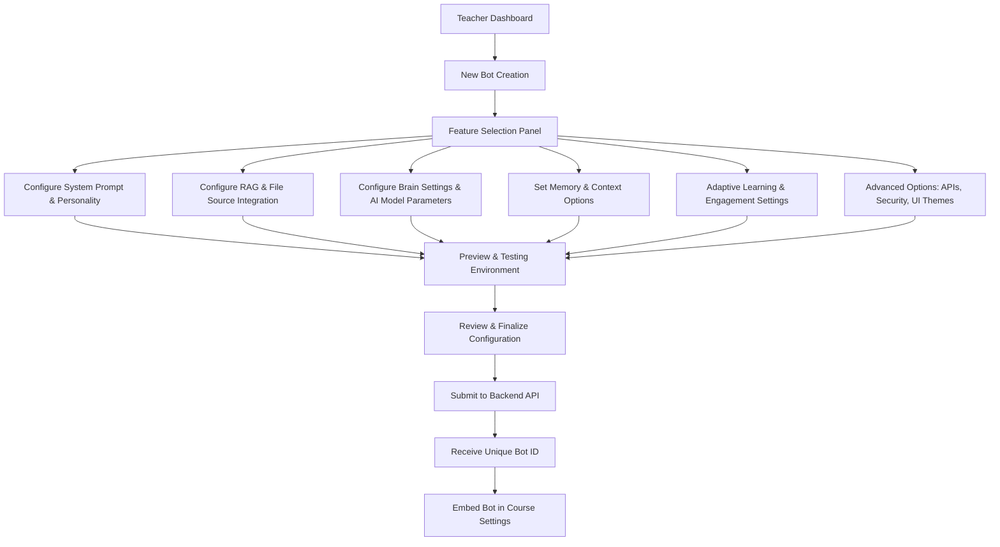

# AI Bot Playground for Teachers – Frontend

Welcome to the AI Bot Playground for Teachers! This project enables educators to design, configure, and deploy AI bots tailored for classroom use. Teachers can select from a rich set of modular features to customize their bot’s behavior, personality, and data sources. Once a bot is configured, the backend processes the setup and returns a unique Bot ID, which can then be embedded into course settings for student interaction.

---

## Table of Contents

- [Overview](#overview)
- [Key Features](#key-features)
- [Architecture & Tech Stack](#architecture--tech-stack)
- [File Structure](#file-structure)
- [Development Timeline](#development-timeline)
- [Flow Diagram](#flow-diagram)
- [Installation & Setup](#installation--setup)
- [Usage](#usage)
- [Testing & Quality Assurance](#testing--quality-assurance)
- [Future Enhancements](#future-enhancements)
- [Contributing](#contributing)
- [License](#license)
- [Contact](#contact)

---

## Overview

The AI Bot Playground is designed to provide teachers with a user-friendly, modular interface for creating AI-powered bots. It supports a variety of configurations, including system prompts, retrieval augmented generation (RAG) with file source integration, customizable brain and memory settings, adaptive learning features, and advanced options like API integrations and security settings. The project emphasizes a responsive and intuitive design suitable for both technical and non-technical users.

---

## Key Features

- **Teacher Dashboard**
  - **Bot Management:** View, search, and manage all created bots.
  - **Analytics Overview:** Basic metrics on bot usage, engagement, and performance.
  - **Quick Actions:** Easy access to create new bots.

- **New Bot Creation Workflow**
  - **Feature Selection Panel:** 
    - Dynamically choose the modules to include:
      - **System Prompt & Personality:** Customize the bot’s tone and instructions.
      - **RAG & File Source Integration:** Upload documents, add URLs, and integrate external data.
      - **Brain Settings:** Configure AI model parameters such as temperature and creativity.
      - **Memory & Context Options:** Define session memory policies and persistent context.
      - **Adaptive Learning & Engagement:** Enable features like dynamic feedback and gamification.
      - **Advanced Options:** Set API keys, security configurations, and UI themes.
  - **Preview & Testing Environment:**
    - Simulate conversations and test the bot’s responses in real-time.
    - Debug and adjust configurations interactively.
  - **Submission & Integration:**
    - Final review of configuration settings.
    - API submission to receive a unique Bot ID.
    - Easy embed option for course integration.

- **User Support & Documentation**
  - **Onboarding Guides:** Step-by-step walkthroughs and tooltips.
  - **Help Center:** Detailed documentation and video tutorials.
  - **Feedback Mechanism:** Collect teacher feedback to refine bot behavior.

- **Future Enhancements**
  - **Analytics Dashboard:** Deeper insights into bot performance and student engagement.
  - **Real-Time Monitoring:** Live data on interactions and adaptive learning efficacy.
  - **Extended Customization:** Additional UI themes and personalized bot templates.

---

## Architecture & Tech Stack

- **Frontend Framework:** 
  - Options include **React**, **Vue**, or **Angular**.
- **State Management:** 
  - Redux, Context API, or Vuex for managing global state.
- **Routing:** 
  - React Router, Vue Router, or Angular Router for seamless navigation.
- **API Integration:** 
  - Axios or Fetch API for communicating with backend services (using a mock API during development).
- **UI Libraries:** 
  - Material UI, Bootstrap, or Tailwind CSS for responsive design.
- **Build Tools & Bundlers:** 
  - Webpack, Vite, or Create React App for efficient builds and development experience.

---

## File Structure

A suggested file structure for the frontend project is as follows:

/src /components /Dashboard Dashboard.jsx BotCard.jsx /BotCreation BotCreationPage.jsx /FeatureSelection FeatureSelector.jsx ModuleSelector.jsx /SystemPrompt SystemPromptForm.jsx /RAGFileSource FileUploader.jsx URLInput.jsx /BrainMemory BrainSettings.jsx MemoryOptions.jsx /AdaptiveLearning AdaptiveSettings.jsx /AdvancedOptions AdvancedSettingsForm.jsx /PreviewTesting PreviewPanel.jsx TestConversation.jsx /services api.js // API calls and mock integration /assets /images /styles main.css App.js index.js /README.md


---

## Development Timeline

This timeline assumes one dedicated development day per week, spanning 12 weeks.

**Week 1: Requirements, Research & Design**
- Finalize feature list and modules (referencing similar projects such as MagicSchool AI, Khanmigo, and GPTeens).
- Create high-fidelity wireframes/mockups using Figma or Sketch.
- Define user flows and interactions; design initial Mermaid diagrams.
- Set up the project repository and choose the tech stack.

**Week 2: Project Setup & Core Infrastructure**
- Initialize project and install necessary dependencies.
- Establish a modular folder structure.
- Configure basic routing (Dashboard, Bot Creation, Preview, etc.).
- Set up a mock API for early development testing.

**Week 3: Teacher Dashboard Development**
- Build a responsive Teacher Dashboard.
- Integrate search and filter functionalities.
- Implement a “Create New Bot” action button.
- Connect the dashboard to the mock API to display sample bot data.

**Week 4: Bot Creation Base Page & Modular Architecture**
- Develop the base page for bot creation.
- Establish component skeletons for each module:
  - Feature Selection, System Prompt, RAG/File Source, Brain & Memory, Adaptive Learning, Advanced Options.
- Set up centralized state management for dynamic configuration data.

**Week 5: Module Development – System Prompt & Personality**
- Build the UI for the System Prompt module.
- Include text area input, template options, and inline tooltips.
- Implement real-time validation and preview features.

**Week 6: Module Development – RAG & File Source Integration**
- Create components for file uploads and URL input.
- Add validations for file types and sizes.
- Develop UI for integrating and previewing curriculum documents.

**Week 7: Module Development – Brain Settings & Memory Options**
- Develop controls for adjusting AI model parameters (temperature, creativity).
- Implement memory options for session and persistent context.
- Add contextual tooltips and help text for each parameter.

**Week 8: Module Development – Adaptive Learning & Engagement**
- Build UI for enabling adaptive learning features (e.g., dynamic feedback, quiz generation).
- Integrate engagement toggles and interactive elements.
- Develop a simulation component to preview adaptive behavior.

**Week 9: Module Development – Advanced Options & Customization**
- Create forms for API keys, third-party integrations, and security settings.
- Enable UI customization options like theme selection and layout preferences.
- Implement functionality for saving presets and draft configurations.

**Week 10: Preview, Testing & User Feedback**
- Build an interactive Preview & Testing panel.
- Implement real-time error handling and debugging features.
- Integrate mechanisms to capture and display user feedback.

**Week 11: Submission Workflow & API Integration**
- Develop a final review page to summarize all configuration choices.
- Implement submission flow with loading states and confirmation dialogs.
- Integrate with the backend API (or advanced mock service) to receive a unique Bot ID.
- Add a copy-to-clipboard feature for easy bot embedding.

**Week 12: UI Polish, Quality Assurance & Deployment Preparations**
- Refine overall UI styling, animations, and responsiveness.
- Conduct comprehensive testing (unit, integration, and cross-device).
- Write detailed user and developer documentation.
- Set up CI/CD pipelines and prepare for production deployment.

---

## Flow Diagram

Below is a Mermaid diagram illustrating the overall flow of the AI Bot Playground:



---

## Installation & Setup

### Prerequisites
- Modern web browser
- Local development server

### Running Locally
1. Clone the repository
2. Navigate to the frontend directory
3. Start a local server:
   ```bash
   # Using Python
   python -m http.server 8000
   
   # Using Node.js
   npx serve
   ```
4. Open `http://localhost:8000` in your browser

---

## Usage

1. Access the Teacher Dashboard to view and manage created bots.
2. Click on "Create New Bot" to start the bot creation workflow.
3. Select the desired modules and configure their settings.
4. Preview and test the bot in real-time.
5. Submit the configuration to receive a unique Bot ID.
6. Embed the bot in your course settings.

---

## Testing & Quality Assurance

- Unit testing: Jest or Mocha for individual component testing.
- Integration testing: Cypress or Playwright for end-to-end testing.
- Cross-device testing: Ensure compatibility across various devices and browsers.

---

## Future Enhancements

- **Analytics Dashboard:** Deeper insights into bot performance and student engagement.
- **Real-Time Monitoring:** Live data on interactions and adaptive learning efficacy.
- **Extended Customization:** Additional UI themes and personalized bot templates.

---

## Contributing

1. Fork the repository
2. Create a feature branch
3. Commit your changes
4. Push to the branch
5. Create a Pull Request

---

## License

This project is licensed under the MIT License - see the LICENSE file for details.

---

## Contact

For questions, suggestions, or collaborations, please contact us at [insert contact information].

---

# מחולל מלווי למידה (Educational Bot Generator)

## Overview
A comprehensive web application for creating AI-powered educational bots. The frontend provides an intuitive, step-by-step interface for teachers to design and customize their learning companions.

## Features

### Bot Creation Workflow
1. **Basic Information**
   - Bot name and language selection (Hebrew/English)
   - Voice customization
   - AI-powered image generation
   - Temperature control (0-0.5)

2. **Data Sources**
   - File upload support
   - YouTube video integration
   - Website link processing
   - Source library with presets
   - Dynamic source management

3. **Scenario Configuration**
   - Bot type selection:
     - Simple bot (fixed prompt)
     - Dynamic bot (conditional responses)
   - AI-assisted prompt generation
   - System prompt customization
   - Dynamic prompting table

### Additional Features
- **Real-time Bot Preview**
  - Interactive chat interface
  - Message simulation
  - Typing indicators
  - Minimizable window

- **State Management**
  - Automatic saving
  - Progress persistence
  - Step validation

- **UI/UX**
  - RTL support for Hebrew
  - Responsive design
  - Progress tracking
  - Modern, clean interface

## Project Structure
```
frontend/
├── index.html              # Main application structure
├── styles/
│   └── main.css           # Comprehensive styling
└── js/
    ├── main.js            # Core application logic
    ├── mockService.js     # Mock data and API simulation
    ├── navigation.js      # Step management
    ├── dataSourcesScreen.js   # Source management
    ├── scenarioScreen.js      # Prompt configuration
    ├── botPreview.js         # Chat interface
    └── autosave.js          # State persistence
```

## Setup & Development

### Prerequisites
- Modern web browser
- Local development server

### Running Locally
1. Clone the repository
2. Navigate to the frontend directory
3. Start a local server:
   ```bash
   # Using Python
   python -m http.server 8000
   
   # Using Node.js
   npx serve
   ```
4. Open `http://localhost:8000` in your browser

## Mock Service
The frontend currently uses a mock service (`mockService.js`) that simulates:
- Bot creation and management
- Image generation
- Chat responses
- Data source processing

This allows for frontend development and testing without backend dependencies.

## Next Steps
1. Backend Integration
   - Replace mock service with actual API calls
   - Implement real authentication
   - Enable persistent storage

2. Enhanced Features
   - Advanced prompt engineering tools
   - Collaborative bot creation
   - Usage analytics
   - Bot sharing capabilities

3. Performance Optimization
   - Asset optimization
   - Caching strategies
   - Load time improvements

## Contributing
1. Fork the repository
2. Create a feature branch
3. Commit your changes
4. Push to the branch
5. Create a Pull Request

## License
This project is licensed under the MIT License - see the LICENSE file for details.
